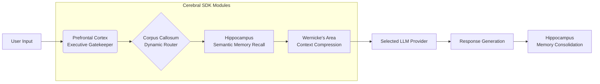

Executive Summary

---
The Cerebral Studio proposes a novel software architecture that models AI orchestration after human neurocognitive systems. This framework moves beyond simple API aggregation by implementing a functional analog of neural subsystems—memory consolidation, executive function, and cross-hemispheric routing—to create a unified, adaptive intelligence platform. The project's intellectual merit lies in its structured, biomimetic approach to developing AI models.

---
1. Conceptual Framework: The Neuromorphic Paradigm

Current AI systems typically operate as isolated models or require rigid, manually-configured pipelines. This project posits that a more robust and flexible system can be engineered by emulating the brain's specialized, yet interconnected, functional regions.
The core innovation is the Cerebral SDK, a middleware engine that treats various AI providers (OpenAI, Anthropic, Google, local models) not as mere tools, but as specialized "cognitive hemispheres" within a unified digital brain.
High-Level System Architecture:
```plain text
┌─────────────────┐    ┌──────────────────┐    ┌────────────────────┐
│   React UI      │◄──►│   FastAPI Layer  │◄──►│  Cerebral SDK      │
│   (Interface)   │    │   (Coordination) │    │ (Neuromorphic Core)│
└─────────────────┘    └──────────────────┘    └─────────┬──────────┘
                                                         │
                                         ┌───────────────┴─────────┐
                                         │   MCP Adapters          │
                                         │   (Provider Abstraction)│
                                         └─────┬─────────┬─────────┘
                                               │         │
                                    ┌──────────┼─────────┼──────────┐
                                    │          │         │          │
                                ┌───┴───┐  ┌───┴───┐   ┌─┴───┐  ┌───┴───┐
                                │OpenAI │  │Llama3 │   │Gemma│  │Ollama │
                                └───────┘  └───────┘   └─────┘  └───────┘

```

---
2. Core Methodology: Functional Decomposition of Intelligence

The Cerebral SDK decomposes the problem of AI orchestration into discrete, interacting modules, each modeled on a specific neurocognitive function. The following diagram illustrates the data flow and decision-making pathway through these modules when processing a user query.

2.1 Prefrontal Cortex (Executive Function)
· Function: Meta-reasoning and task eligibility. This module applies heuristic rules and state-based logic to determine if and how the system should respond to an input.
· Technical Implementation: A rules engine that can inhibit responses based on content, current system state (e.g., 'reflection' mode), or predefined goals.
· Significance: Introduces a layer of autonomous decision-making and self-regulation absent in standard chat systems.
2.2 Hippocampus (Long-Term Memory)
· Function: Manages persistent, semantically-accessible memory.
· Technical Implementation: Integrates a vector database (via sentence-transformers) to encode conversational events into numerical embeddings. Enables content-based similarity search for context retrieval, moving beyond simple recency.
· Significance: Shifts memory from a passive log to an active, queryable knowledge base, crucial for maintaining coherence over long interactions.
2.3 Corpus Callosum (Inter-Model Routing)
· Function: Dynamically selects the optimal AI provider for a given query.
· Technical Implementation: Employs a lightweight LLM (e.g., GPT-4o-mini) to analyze the user's request against a map of provider specialties (e.g., OpenAI for code, Anthropic for nuanced text).
· Significance: Replaces static configuration with intelligent, context-aware routing, optimizing for performance and cost-effectiveness.
2.4 Wernicke's Area (Context Management)
· Function: Actively manages the finite context window of LLMs.
· Technical Implementation: Implements a token budgeting system that prioritizes context snippets by importance. Uses LLM-powered summarization to compress low-priority information, maximizing relevant data within token limits.
· Significance: Solves the key engineering challenge of context overflow in a principled, AI-native manner.

---
3. Integration and Interplay: The System as a Whole

The modules do not operate in isolation. Their interplay creates the system's  (hopefully) emergent intelligence:
4. A user query is first evaluated by the Prefrontal Cortex.
5. If approved, the Corpus Callosum analyzes it to select a provider.
6. Simultaneously, the Hippocampus performs a semantic search for relevant past interactions.
7. The Wernicke's Area takes these retrieved memories and the current query, fitting them into the selected provider's context window via prioritization and summarization.
8. The chosen provider generates a response, which is then logged by the Hippocampus for future recall.

This creates a feedback loop where each interaction informs future ones, leading to increasingly context-aware and efficient responses.

---
9. Project Implementation: Cerebral Studio

The Cerebral SDK is embedded within Cerebral Studio, a full-stack web application that provides a practical interface for interacting with the framework.
· Frontend (React): A SillyTavern-like interface for conversation management and system monitoring.
· Backend (FastAPI): Handles web requests, manages MCP (Model Context Protocol) servers, and serves as the host for the Cerebral SDK.
· Deployment: Containerized with Docker for reproducibility and ease of deployment, supporting both cloud and local (Ollama) AI models.

---
10. Intellectual Contribution and Distinction

This project's contribution is not merely a new interface but a novel architectural paradigm for AI systems. By grounding the design in a biomimetic model, it offers:
· A Structured Framework for AI Orchestration: Provides a coherent, scalable model for combining multiple AI systems.
· A Testable Model of Digital Cognition: Each module represents a hypothesis about functional decomposition that can be experimentally validated and refined.
· A Bridge between Neuroscience and Computer Science: Demonstrates how computational models of brain function can solve practical engineering challenges in AI.
Cerebral Studio represents a significant step beyond current multi-model platforms by introducing a principled, architecturally-grounded approach to creating unified, adaptive, and intelligent systems.

---