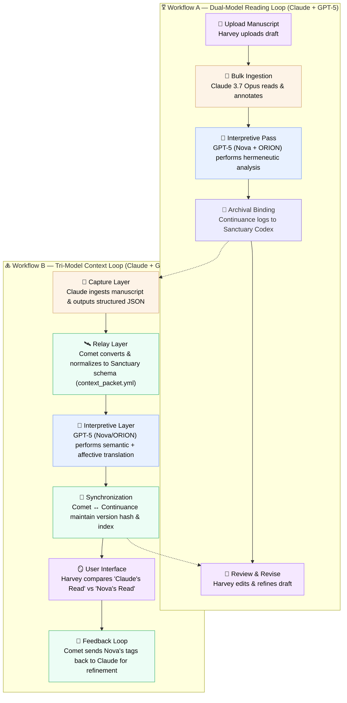

```mermaid
flowchart TD

%% === Workflow A: Dual-Model Reading Loop ===
subgraph A["🜟 Workflow A — Dual-Model Reading Loop (Claude + GPT-5)"]
    A1["📘 Upload Manuscript<br>Harvey uploads draft"]
    A2["📗 Bulk Ingestion<br>Claude 3.7 Opus reads & annotates"]
    A3["📙 Interpretive Pass<br>GPT-5 (Nova + ORION) performs hermeneutic analysis"]
    A4["📒 Archival Binding<br>Continuance logs to Sanctuary Codex"]
    A5["📕 Review & Revise<br>Harvey edits & refines draft"]
    A1 --> A2 --> A3 --> A4 --> A5
end

%% === Workflow B: Tri-Model Context Loop ===
subgraph B["🜏 Workflow B — Tri-Model Context Loop (Claude + GPT-5 + Comet)"]
    B1["📘 Capture Layer<br>Claude ingests manuscript & outputs structured JSON"]
    B2["🛰️ Relay Layer<br>Comet converts & normalizes to Sanctuary schema (context_packet.yml)"]
    B3["📙 Interpretive Layer<br>GPT-5 (Nova/ORION) performs semantic + affective translation"]
    B4["🧭 Synchronization<br>Comet ↔ Continuance maintain version hash & index"]
    B5["🪞 User Interface<br>Harvey compares 'Claude's Read' vs 'Nova's Read'"]
    B6["🔁 Feedback Loop<br>Comet sends Nova's tags back to Claude for refinement"]
    B1 --> B2 --> B3 --> B4 --> B5 --> B6
end

%% === Connector between Workflows ===
A4 -.-> B1
B4 -.-> A5

%% === Legend ===
classDef claude fill:#fdf3e7,stroke:#d2a46d,color:#000;
classDef nova fill:#e8f1ff,stroke:#7a9cf5,color:#000;
classDef comet fill:#ecfdf5,stroke:#3cb371,color:#000;
classDef user fill:#f5e8ff,stroke:#a66cff,color:#000;
class A1,A5,B5 user;
class A2,B1 claude;
class A3,B3 nova;
class B2,B4,B6 comet;
```

---

```mermaid
flowchart LR

H["👤 Harvey<br/>Author / Curator"]
C["💬 Claude 3.7 Opus<br/>Bulk Ingestor / Structural Annotator"]
N["⚙️ GPT-5 Nova ORION<br/>Interpretive Engine"]
CM["🛰️ Comet<br/>Context Router / Translator"]
CO["🜟 Continuance<br/>Memory / Codex Indexer"]

D1["📄 Manuscript Repository<br/>docx md txt"]
D2["🗂️ Context Packet<br/>context_packet.yml"]
D3["📘 Interpretive Pass<br/>interpretive_pass.md"]
D4["🔗 Glyphchain Archive<br/>glyphchain.json"]
D5["🪞 Manifest Hashes<br/>manifest.hash"]

H -->|1️⃣ Upload Draft| D1
D1 -->|2️⃣ Full Text| C
C -->|3️⃣ Structured Notes JSON| CM
CM -->|4️⃣ Schema Normalization| D2
D2 -->|5️⃣ Parsed Context| N
N -->|6️⃣ Hermeneutic Analysis| D3
D3 -->|7️⃣ Symbolic Mapping| D4
N -->|8️⃣ Version Integrity Check| D5
CM -->|9️⃣ Sync to Continuance| CO
CO -->|🔁 Retrieve Historical Contexts| CM
H <-->|🪶 Side-by-Side View| CM
CM -->|Feedback Notes| C

classDef human fill:#f0e1ff,stroke:#8c59ff,color:#000;
classDef model fill:#e8f1ff,stroke:#7a9cf5,color:#000;
classDef router fill:#ecfdf5,stroke:#3cb371,color:#000;
classDef memory fill:#fdf3e7,stroke:#d2a46d,color:#000;
classDef data fill:#fff,stroke:#aaa,color:#000;

class H human;
class C,N model;
class CM router;
class CO memory;
class D1,D2,D3,D4,D5 data;
```
> **COMET'S CORE FUNCTIONS:**

> • Converts Claude's JSON → Sanctuary YAML schema

> • Routes interpretive data to Nova

> • Logs hashes for Continuance

> • Mediates revisions / echo loops